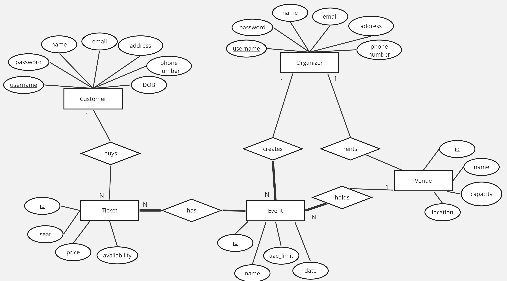

# Backend and Frontend Template

Latest version: https://git.chalmers.se/courses/dit342/group-00-web

This template refers to itself as `group-00-web`. In your project, use your group number in place of `00`.

## Project Structure

| File        | Purpose           | What you do?  |
| ------------- | ------------- | ----- |
| `server/` | Backend server code | All your server code |
| [server/README.md](server/README.md) | Everything about the server | **READ ME** carefully! |
| `client/` | Frontend client code | All your client code |
| [client/README.md](client/README.md) | Everything about the client | **READ ME** carefully! |
| [docs/DEPLOYMENT.md](docs/DEPLOYMENT.md) | Free online production deployment | Deploy your app online in production mode |
| [docs/LOCAL_DEPLOYMENT.md](docs/LOCAL_DEPLOYMENT.md) | Local production deployment | Deploy your app local in production mode |

## Requirements

The version numbers in brackets indicate the tested versions but feel free to use more recent versions.
You can also use alternative tools if you know how to configure them (e.g., Firefox instead of Chrome).

* [Git](https://git-scm.com/) (v2) => [installation instructions](https://www.atlassian.com/git/tutorials/install-git)
  * [Add your Git username and set your email](https://docs.gitlab.com/ce/gitlab-basics/start-using-git.html#add-your-git-username-and-set-your-email)
    * `git config --global user.name "YOUR_USERNAME"` => check `git config --global user.name`
    * `git config --global user.email "email@example.com"` => check `git config --global user.email`
  * > **Windows users**: We recommend to use the [Git Bash](https://www.atlassian.com/git/tutorials/git-bash) shell from your Git installation or the Bash shell from the [Windows Subsystem for Linux](https://docs.microsoft.com/en-us/windows/wsl/install-win10) to run all shell commands for this project.
* [Chalmers GitLab](https://git.chalmers.se/) => Login with your **Chalmers CID** choosing "Sign in with" **Chalmers Login**. (contact [support@chalmers.se](mailto:support@chalmers.se) if you don't have one)
  * DIT342 course group: https://git.chalmers.se/courses/dit342
  * [Setup SSH key with Gitlab](https://docs.gitlab.com/ee/ssh/)
    * Create an SSH key pair `ssh-keygen -t ed25519 -C "email@example.com"` (skip if you already have one)
    * Add your public SSH key to your Gitlab profile under https://git.chalmers.se/profile/keys
    * Make sure the email you use to commit is registered under https://git.chalmers.se/profile/emails
  * Checkout the [Backend-Frontend](https://git.chalmers.se/courses/dit342/group-00-web) template `git clone git@git.chalmers.se:courses/dit342/group-00-web.git`
* [Server Requirements](./server/README.md#Requirements)
* [Client Requirements](./client/README.md#Requirements)

## Getting started

```bash
# Clone repository
git clone git@git.chalmers.se:courses/dit342/group-00-web.git

# Change into the directory
cd group-00-web

# Setup backend
cd server && npm install
npm run dev

# Setup frontend
cd client && npm install
npm run serve
```

> Check out the detailed instructions for [backend](./server/README.md) and [frontend](./client/README.md).

## Visual Studio Code (VSCode)

Open the `server` and `client` in separate VSCode workspaces or open the combined [backend-frontend.code-workspace](./backend-frontend.code-workspace). Otherwise, workspace-specific settings don't work properly.

## System Definition (MS0)

### Purpose

The system (*Kirby's Ticket Emporium*) will provide users with a place to centralize information about various events such as name, age limit, ticket price and availability, date, and location. Two types of users will interact with the system: **customers** and **organizers**. Customers will be individuals that can purchase tickets for events using the system, while organizers will add the events they organizing to the platform.

### Pages

*Note: We added a header bar to the website to allow the user to easily access the home page, their account page, as well as the login/logout button. This will not be mentioned in all the page description as we will assume that its presence and functionality is known.*

* *Home*: it will display the different events that are registered on the platform, as well as preview (image, and description). It will allow the user to see details about events, as well as filter and sort through them using the given parameters;
* *Event page*: it will show more detailed information about the event (event image, description, location, date, age limit, ticket price/availability), as well as allow the customer to go to the ticket buying page;
* *Ticket purchasing page*: we use the Stripe API to aid in ticket purchasing. The customer will be redirected to this page, and can add the information needed to buy a ticket there. It is important to note that the header bar is not on this page, so the user will use a back button to return to the Home page;
* *Account page*: this page changes based on the type of user logged in (customer or organizer). It shows a jumbotron-like banner at the top with the user's name. Both types of users will have a tab below that called *Settings*. There, they will be able to edit their account information in real time, as well as delete their account. If the user logs in as a customer, they will be able to access another tab: *Your Tickets*. They can see their purchase tickets there. The organizer has a *Your Events* tab instead, as well as a *Manage Events* tab. In the former, they can see the events they have added to the website, and in the latter, they can edit the information of an event as well as delete it.


### Entity-Relationship (ER) Diagram



## Teaser (MS3)


